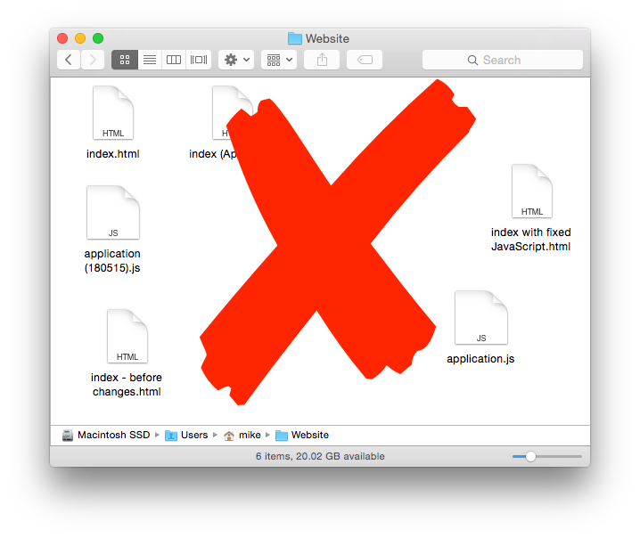
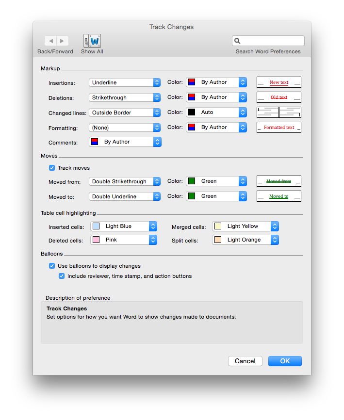
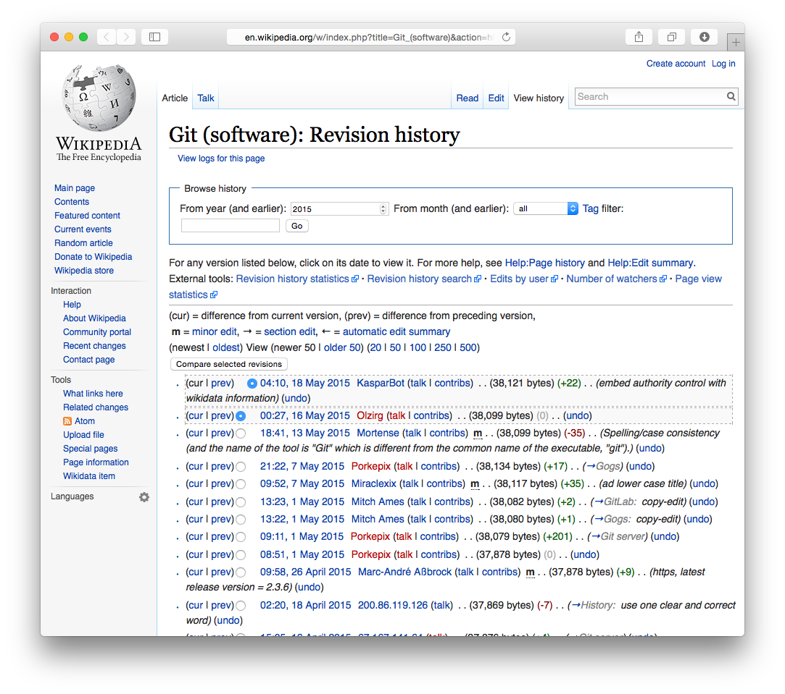
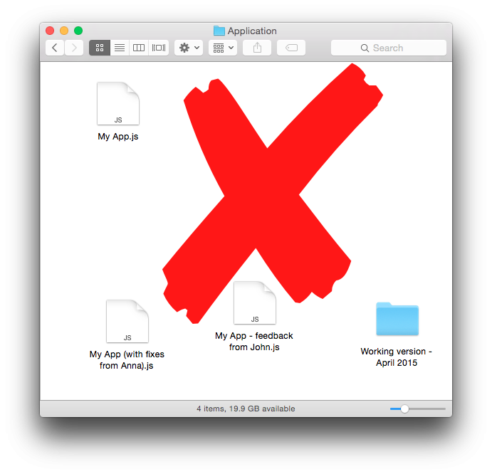

# Introduction to Git

^ Git is an example of what is known as a source control system, or version control system. This is going to be a very brief tour of what a source control system and the problems that it solves. With some history of how we've arrived at git along the way.

^ After that we'll be diving straight into a practical session.

^ Before we start can I have a quick check of who has used git already? who has used a different source control too (Subversion etc.)

---

# What/why source control?

## Keeping track of changes
 

^ If you've been coding even for a little while you've probably already discovered the value of keeping track of the changes you've made to your program as you go along. For example taking a copy of your source file when you get to a point where everything is working and before you start on the next change.

^ You may also have found yourselves testing how far back the Undo command goes it your editor :)

^ The trouble with this approach is that it's pretty error-prone and quite quickly becomes unwieldly and hard to maintain.

---

^ The earliest source control tools were designed to solve this problem by providing a way to store multiple versions of a file and to be enable comparing versions to see the differences and allowing an easy way to retrieve earlier versions.

---

^ You've probably seen this kind of functionality built into specific applications or websites that you use, for example Microsoft Word can track and highlight changes being made to a document. When anyone edits a Wikipedia page this creates a new version of the page and anyone can compare this version to previous versions in order to see what changes were made, and to revert them if needed!

^ The idea of a source control system is that it provides these features in a way that is separate, and so independent, of the programming language and text editor that you're using.

---

# What/why source control?

## Collaborating

