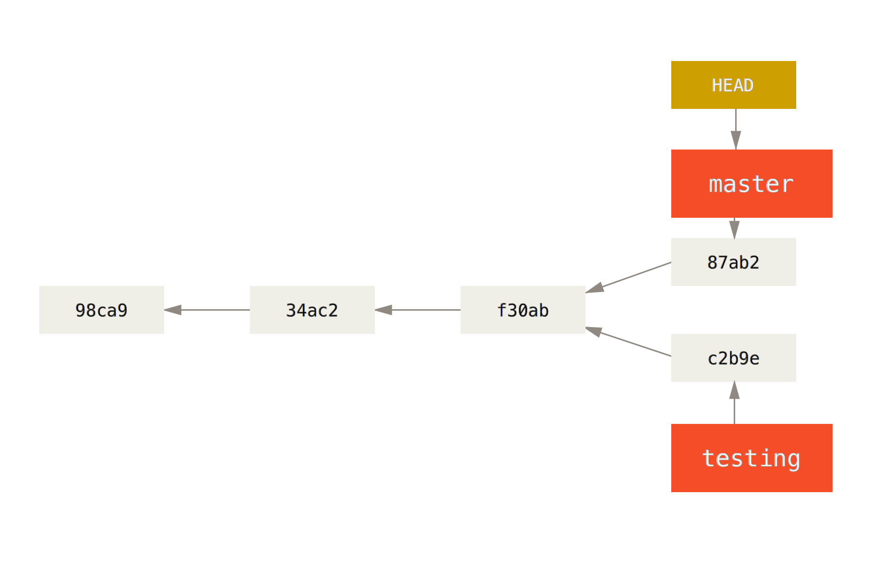

# Introduction to Git

^ Git is an example of what is known as a source control system, or version control system. This is going to be a brief tour of what a source control system and the problems that it solves. With some history of how we've arrived at git along the way.

^ After that we'll be diving straight into a practical session.

^ Before we start can I have a quick check of who has used git already? who has used a different source control too (Subversion etc.)

---

# Keeping track of changes
 

^ If you've been coding even for a little while you've probably already discovered the value of keeping backup copies of your program as you go along. For example taking a copy of your source file when you get to a point where everything is working and before you start on the next change.

^ You may also have found yourselves testing how far back the Undo command goes it your editor :)

^ The trouble with this approach is that it's pretty error-prone and quite quickly becomes unwieldy and hard to maintain.

---

^ The first source control tools were designed to solve this problem by introducing a "repository" that can store multiple versions of files. The idea is that you work on your project and when you reach certain point you use a "commit" command to store the current state of each file as a new version in the repository. 

^ You have a single working copy each file outside of the repository. The source control system then provides commands to let you retrieve previous versions of files and to compare different versions of each file. This works really well with source code which is just plain text.

---

^ You've probably seen this kind of functionality built into specific applications or websites that you use

^ For example Microsoft Word can track and highlight changes being made to a document.

^ When anyone edits a Wikipedia page this creates a new version of the page and anyone can compare this version to previous versions in order to see what changes were made, and to undo them if needed!

^ The idea of a source control system is that it provides these features in a way that is separate, and so independent, of the programming language and text editor that you're using.

---

# Collaborating

^ The issue we have now is if the repository is on a single computer, how can several people work together on a project? How can we can streamline the process of working with changes  that have been made by different people?

---

^ The next progression in source control systems is the introduction of using a repository stored on a centralised server. This kind of source control system introduces some new features to let multiple people make a copy of a project from the server and to submit new versions back to the server. The version control system also provides a command for each person to update their working copy from the server, picking up the changes made by everyone else.

^ This is a big improvement  and indeed is the the way that many teams and companies manage the code for software projects today. However it does have some downsides: mainly a single point of failure and also it's not possible to commit changes when working somewhere without access to the central server. It also adds some overhead when first starting a project as it might need some set up on the server before a new project an be added.

---

^ This leads us to distributed version control which is the approach used by git. Here each computer has its own full copy of the repository including all of the historical versions of files.

^ There are several other version control systems that also more this way (such as Mercurial and Bazaar) but I'm going to switch to speaking more specifically in terms of git now.

^ A new git repository can be created with a single command on any computer with git installed. Git then provides a way for other people to make a copy of a repository (called cloning). 

^ When you commit some changes this will only affect your own copy of the repository and so can be done without any access to the Internet. When you're ready to share changes Git then provides a mechanism to transfer your commits to another copy of the repository (called pushing) and to receive a copy of changes from another copy of the repository (called pulling)

^ Whilst it's possible for people working together on a project and push and pull directly between their own laptops, in practice it's easier to use a copy of the repository held on a server as an intermediary. This is what GitHub is for.

---

^ Staging, commit

---

# Branching

---

# Credits

All diagrams taken from the **Pro Git** book written by Scott Chacon and Ben Straub  published under the [Creative Commons Attribution Non Commercial Share Alike 3.0 licence](http://creativecommons.org/licenses/by-nc-sa/3.0/)
Available at: [git-scm.com/book](https://git-scm.com/book/en/v2)

-

Slides available at: [github.com/CodeUpMCR/git-intro](https://github.com/CodeUpMCR/git-intro)